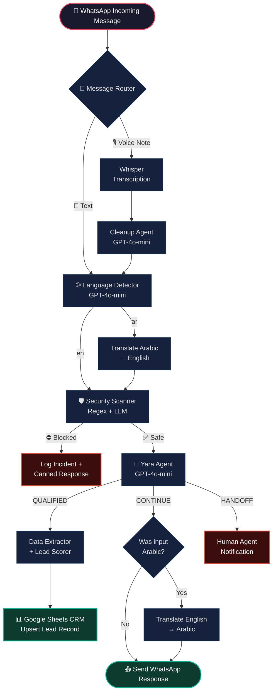
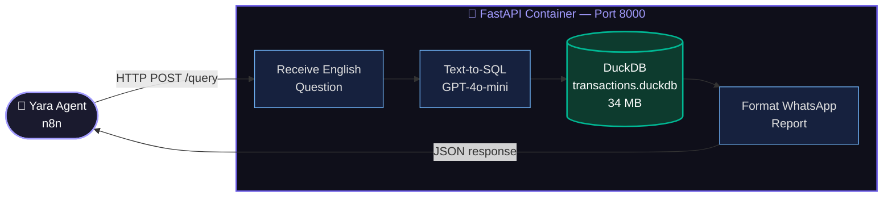

# 🏙️ Bilingual WhatsApp Real Estate Lead Generation System

> **An enterprise-grade, multi-agent AI automation pipeline designed for the UAE real estate sector.**
> Automatically qualifies leads, retrieves live Dubai Land Department (DLD) market data, and delivers bilingual (Arabic/English) responses — all through WhatsApp.

---

## 📌 The Problem

Real estate agencies lose up to **60% of inbound leads** due to:
- **Response delays:** Clients inquire at any hour. Human agents can't always respond instantly.
- **Language friction:** Agents can't fluently qualify Arabic-speaking clients at speed.
- **Missing market context:** Sales agents improvise pricing data, generating client distrust.

---

## ✅ What This System Does

This system acts as a **24/7 AI property concierge** that:
1. Receives WhatsApp inquiries in **any language** (English, Arabic, voice notes).
2. Automatically **classifies, sanitizes, and qualifies** leads across a 5-field questionnaire.
3. **Queries real Dubai Land Department (DLD) transaction data** in real time — not pre-trained LLM guesses.
4. Responds in the **same language the user used** (Arabic ↔ English).
5. **Scores and logs** every qualified lead directly into a Google Sheets CRM.

---

## 🏗️ System Architecture

The pipeline is divided into two decoupled layers:

### Layer 1: The n8n Orchestration Layer (Conversational Intelligence)



### Layer 2: The RAG Analytics Microservice (Market Intelligence)

When Yara (the AI agent) detects a market question (price, yield, volume), she calls an external tool — a **containerized FastAPI microservice** that queries a real DLD database.



---

## 🤖 The 6-Agent Pipeline

| Agent | Technology | Role |
| :--- | :--- | :--- |
| **Agent 1: Voice Transcriber** | OpenAI Whisper | Converts `.ogg` WhatsApp voice notes to text |
| **Agent 2: Cleanup Agent** | GPT-4o-mini | Removes disfluencies and resolves pronouns from transcriptions |
| **Agent 3: Language Detector** | GPT-4o-mini | Classifies language (`en` / `ar` / `arabizi`) |
| **Agent 4: Security Scanner** | Regex + GPT-4o-mini | 4-layer prompt injection and abuse detection |
| **Agent 5: Yara (Qualification Engine)** | GPT-4o-mini + DuckDB Tool | Conducts the conversation, calls market data tool |
| **Agent 6: Data Extractor + Scorer** | GPT-4o-mini + JavaScript | Parses qualified JSON, scores lead, pushes to CRM |

---

## 🌐 The Bilingual Translation Architecture

A key design decision is **isolating translation from reasoning**. Yara only ever receives English text and generates English responses. Two dedicated translation nodes handle localization:

```
Arabic User → [Translate to English] → Yara → [Translate to Arabic] → Arabic User
English User ───────────────────────→ Yara ────────────────────────→ English User
```

**Why this matters:**
- Yara remains a single-language agent → reduces token costs by ~40%
- Tool calls (`query_real_estate_market_data`) always fire in English → prevents Arabic formatting from breaking SQL generation
- Translation quality is isolated from reasoning quality

---

## 📈 Lead Scoring System

Qualified leads are scored on a **100-point system** and assigned to a tier:

| Factor | Max Points | Scoring Logic |
| :--- | :---: | :--- |
| **Intent** | 20 | Buy/Invest → 20pts \| Rent → 10pts |
| **Timeline** | 20 | Immediate/3 months → 20pts \| 6 months → 10pts |
| **Financing** | 20 | Cash/Mortgage → 20pts \| Unknown → 0pts |
| **Budget** | 30 | ≥5M AED → 30pts \| 1M-5M → 20pts \| <1M → 10pts |
| **Golden Visa Interest** | 10 | Yes → 10pts |

**Lead Tiers:**
- 🔴 **Tier A (80-100pts):** Hot Lead — contact immediately
- 🟠 **Tier B (50-79pts):** Warm Lead — follow up within 24h
- 🟡 **Tier C (30-49pts):** Cool Lead — add to nurture sequence
- ⚪ **Tier D (<30pts):** Cold Lead — low priority

Budgets are **currency-normalized** to AED before scoring (supporting USD, EUR, and AED inputs).

---

## 🛡️ 4-Layer Security Architecture

| Layer | Mechanism | Purpose |
| :--- | :--- | :--- |
| **Layer 1** | Input regex scanner | Detects prompt injection, script tokens, oversized payloads |
| **Layer 2** | Hardened system prompts | Instruction boundary enforcement on all LLM calls |
| **Layer 3** | Output leakage scanner | Prevents internal system instructions from appearing in responses |
| **Layer 4** | Rate limiter | Throttles messages per phone number to prevent API abuse |

---

## 🗄️ Database Schema

**PostgreSQL (Operational Data):**

| Table | Contents |
| :--- | :--- |
| `incoming_messages` | All raw Meta Webhook payloads |
| `voice_transcriptions` | Whisper STT outputs and cleaned reformulations |
| `ai_responses` | Yara's conversational replies and routing flags |
| `security_events` | Security incident ledger |
| `lead_qualification` | Final structured lead records |

**DuckDB (Market Analytics):**

| File | Contents |
| :--- | :--- |
| `data/transactions.duckdb` | 34MB of real Dubai Land Department transaction records including prices, rents, yields, and community data |

> ⚠️ The `data/` directory is excluded from this repository via `.gitignore`. You must supply your own DuckDB transaction database file to enable the RAG market queries.

---

## 🧩 Key Engineering Challenges Solved

### 1. Hallucination Prevention via RAG Grounding
Real estate agents cannot afford inaccurate price data. By strictly routing all market queries through the DuckDB SQL agent and instructing Yara she is *"forbidden from quoting any number unless it is returned by the database tool"*, we eliminated LLM-generated price hallucinations.

### 2. Polyglot Microservice Architecture
The RAG analytics engine (Python/DuckDB/LangChain) runs inside a dedicated Docker container. n8n communicates with it via `HTTP POST` over the internal Docker bridge network (`whatsapp-net`). This decoupled approach means the messaging layer (n8n) and analytics layer (FastAPI) can be upgraded, replaced, or scaled independently.

### 3. Meta Webhook Handshake Casting
The Meta Developer API sends `hub.challenge` as a numeric integer but requires it returned as a raw `text/plain` string. The n8n responder was explicitly configured to force string casting: `{{ $json.query["hub.challenge"] + "" }}`.

### 4. SQL Injection Prevention
All PostgreSQL nodes use positional parameterization (`$1`, `$2`) rather than direct string interpolation, sanitizing inputs at the driver level.

### 5. Multi-Currency Lead Scoring Normalization
Lead budgets submitted in USD or EUR are converted to AED equivalent values before scoring, ensuring international leads are scored correctly regardless of the currency they stated.

---

## 🚀 Local Setup and Installation

### Prerequisites
- Docker and Docker Compose installed
- OpenAI API Key (GPT-4o-mini + Whisper)
- Meta Developer App linked to a WhatsApp Business Sandbox number
- Ngrok (for local tunnel forwarding during development)

### Steps to Run

1. **Clone the repository:**
   ```bash
   git clone https://github.com/ShaikTanzeel/Whatsapp_Realestate_Lead_Generation_Chatbot
   cd Whatsapp_Realestate_Lead_Generation_Chatbot
   ```

2. **Configure environment variables:**
   ```bash
   cp .env.example .env
   # Fill in your OpenAI, Meta, Postgres, and Google Sheets credentials
   ```

3. **Launch all containers:**
   ```powershell
   # Windows
   .\scripts\start.ps1

   # Linux / macOS
   chmod +x ./scripts/start.sh && ./scripts/start.sh
   ```
   This starts: PostgreSQL, n8n, pgAdmin, and the RAG FastAPI microservice.

4. **Verify the RAG service is healthy:**
   ```bash
   curl http://localhost:8000/health
   # Expected: {"status": "healthy", "database_connected": true}
   ```

5. **Initialize the database schema:**
   ```powershell
   Get-Content init.sql | docker exec -i whatsapp_postgres psql -U postgres_admin -d n8n_database
   ```

6. **Import and configure the n8n workflow:**
   - Open `http://localhost:5678`
   - Import `main_whatsapp_flow.json`
   - Configure your OpenAI and Meta credentials inside the respective nodes
   - Register the public ngrok webhook URL in your Meta Developer Portal

---

## 🧰 Tech Stack

| Component | Technology |
| :--- | :--- |
| **Orchestration** | n8n (self-hosted via Docker) |
| **Conversational AI** | OpenAI GPT-4o-mini |
| **Voice Transcription** | OpenAI Whisper |
| **Market Analytics API** | Python · FastAPI · LangChain · DuckDB |
| **Operational Database** | PostgreSQL 16 |
| **CRM** | Google Sheets (via n8n connector) |
| **Infrastructure** | Docker Compose · ngrok (development) |
| **Security** | 4-layer pipeline: Regex · LLM hardening · Output scanner · Rate limiting |
| **Compliance** | UAE PDPL (first-message consent + data deletion flows) |
