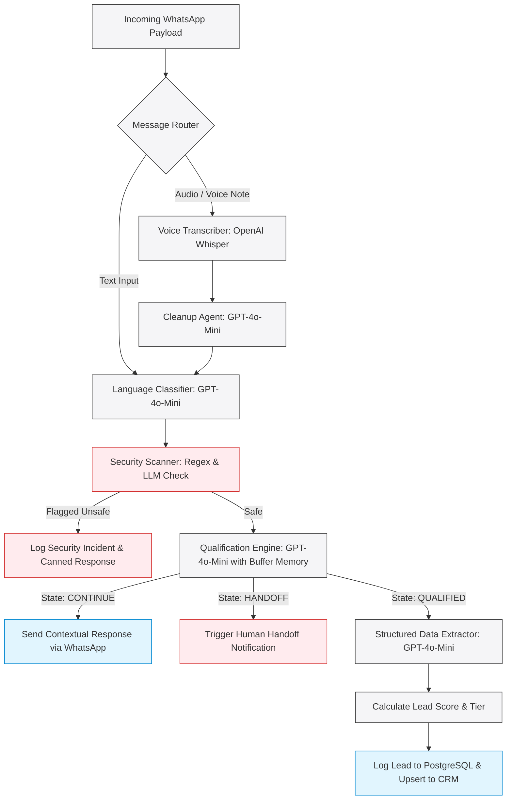

# Bilingual WhatsApp Real Estate Lead Generation System

An enterprise-grade, multi-agent AI automation pipeline built using n8n, PostgreSQL, and OpenAI. The system is designed specifically for the UAE real estate sector, enabling real estate brokerages to ingest, process, sanitize, and qualify lead inquiries submitted in English and Arabic (both written and spoken voice notes) and push structured records directly into a CRM.

---

## Technical Architecture Overview

The system utilizes a modular 6-agent pipeline layout. It isolates text and voice inputs, runs transcription cleanup, verifies security, manages memory buffers, score leads, and extracts a structured JSON payload.



---

## Core System Capabilities

### 1. Multi-Modal Ingestion and Message Routing
- Handles incoming text and binary audio data (WhatsApp voice notes in `.ogg` format).
- Downstream processing is isolated: text inputs bypass transcription nodes directly to optimize execution latency, while voice inputs undergo asynchronous transcription.

### 2. Context-Aware Voice Cleanup Agent
- Voice transcriptions are notoriously unstructured, full of disfluencies ("um", "like", "يعني") and incomplete thoughts.
- A dedicated **Reformulation/Cleanup Agent** references the immediate conversation context to resolve pronouns and rewrite transcriptions into clean, concise sentences while retaining all core parameters (budgets, locations, preferences).

### 3. Dual-Language Support (English and Arabic)
- Automatically detects the user's language (Fusha, regional Arabic dialects, Arabizi/Franco-Arabic, or English).
- Translates state tracking prompts internally while replying back to the customer in the language they initiated.

### 4. 4-Layer Input/Output Sanitization
- **Layer 1 (Input Regex Checker):** Evaluates payload strings for common prompt injection patterns, malicious script tokens, and character length limits.
- **Layer 2 (Hardened System Prompts):** Applies distinct instruction boundaries preventing the agent from executing external code or revealing its internal prompt guidelines.
- **Layer 3 (Output Leakage Scanner):** Analyzes outgoing text to ensure no system instructions or backend technical tokens are leaked to the user.
- **Layer 4 (Rate Limiting):** Curbs API abuse by limiting message rates per phone number.

### 5. Persistent PostgreSQL Logging and Auditing
- Incoming queries, speech-to-text outputs, AI responses, security logs, and final qualified lead data are stored in a dedicated relational schema.
- Data structures are isolated from n8n internal tables to ensure schema durability during platform updates.

### 6. UAE PDPL Compliance
- Built with privacy-first architecture including explicit consent capturing on first user interaction.
- Implements a two-step confirmation data deletion sequence (triggered when a user sends a DELETE command), which automatically clears local conversation memory buffers and targets database contacts using cascading deletes.

---

## Database Schema Structure

The PostgreSQL schema is defined in `init.sql` and includes the following tables:

- **`incoming_messages`:** Logs all raw incoming payloads from Meta Webhooks.
- **`voice_transcriptions`:** Tracks Whisper STT outputs and reformed texts side-by-side.
- **`ai_responses`:** Stores Yara's conversational responses and routing state tags.
- **`security_events`:** Maintains a ledger of security incident violations (blocked inputs).
- **`lead_qualification`:** Stores final, structured client properties (name, location, budget, intent, financing, timeline, visa preferences, and overall lead score).

---

## Key Engineering Challenges Solved

This section highlights the technical problems resolved during the implementation and auditing process:

### 1. Webhook Handshake Verification Casting
- **Challenge:** The Meta Developer API conducts a validation handshake sending `hub.challenge` as a numeric integer, requiring our webhook node to return it as a raw, unquoted plain-text string. The orchestration engine implicitly converted numeric variables into formatted JSON, failing Meta's strict verification.
- **Resolution:** Modified the webhook responder mapping expression to force string casting using `{{ $json.query["hub.challenge"] + "" }}` and set the HTTP Content-Type strictly to `text/plain`.

### 2. SQL Injection Prevention via Parametrization
- **Challenge:** Initial chat history lookup nodes constructed query strings by directly interpolating dynamic payload values: `WHERE phone_number = '{{ $json.phone_number }}'`. This introduced vulnerabilities to SQL Injection.
- **Resolution:** Parameterized all PostgreSQL nodes by replacing string interpolations with positional arguments (`$1`) and matching them directly to the node's query parameters collection, sanitizing user inputs at the driver level.

### 3. PostgreSQL SERIAL Primary Key Constraints
- **Challenge:** Database insert operations frequently crashed with duplicate key violations because the low-code canvas explicitly passed `id: 0` in the insert payloads, overriding PostgreSQL's automatic serialization sequence.
- **Resolution:** Surgically removed the `id` column mapping from all insert nodes. This offloaded identifier increments to the database engine's native `SERIAL PRIMARY KEY` handler.

### 4. Lead Profile Update Upsert Logic
- **Challenge:** Returning leads caused database constraint errors when the system attempted to insert new rows for existing phone numbers, which violated the table's `UNIQUE` constraint.
- **Resolution:** Reconfigured the database mapping node to perform an SQL `UPSERT` matching on the `phone_number` key rather than a normal `INSERT`, ensuring existing profiles are updated while new leads are appended.

### 5. Multi-Currency Lead Scoring Normalization
- **Challenge:** Lead scoring code nodes misclassified international leads since they evaluated raw budget amounts (e.g., scoring $1.5M USD lower than a 5M AED threshold).
- **Resolution:** Programmed a currency normalizer inside the evaluation node that standardizes international currencies (USD, EUR) to AED equivalent values based on exchange rates before calculating lead scoring tiers.

---

## Local Setup and Installation

### Prerequisites
- Docker and Docker Compose installed.
- An OpenAI API Key (required for Whisper and GPT-4o-Mini nodes).
- A Meta Developer App linked to the WhatsApp Business Sandbox.
- Ngrok installed (for local tunnel forwarding).

### Steps to Run

1. **Clone the repository:**
   ```bash
   git clone <your-repository-url>
   cd Whatsapp_Realestate_Lead_Generation_Chatbot
   ```

2. **Configure environment variables:**
   Copy the example template and populate it with your local credentials and API keys:
   ```bash
   cp .env.example .env
   ```

3. **Start the local Docker containers:**
   Use the provided automated script to verify Docker status, load environment variables, launch PostgreSQL and n8n services, and open the ngrok tunnel:
   - **On Windows (PowerShell):**
     ```powershell
     .\scripts\start.ps1
     ```
   - **On Linux / macOS (Bash):**
     ```bash
     chmod +x ./scripts/start.sh
     ./scripts/start.sh
     ```

4. **Verify the database tables:**
   Verify that database containers are running and initialize the schemas:
   ```powershell
   Get-Content init.sql | docker exec -i whatsapp_postgres psql -U postgres_admin -d whatsapp_lead_db
   ```

5. **Import and Configure n8n Workflow:**
   - Log in to your local dashboard at `http://localhost:5678`.
   - Import the `main_whatsapp_flow.json` file.
   - Configure your Meta and OpenAI credentials inside the respective nodes.
   - Copy the public webhook URL printed by the startup script and register it in your Meta Developer Portal callback settings.
