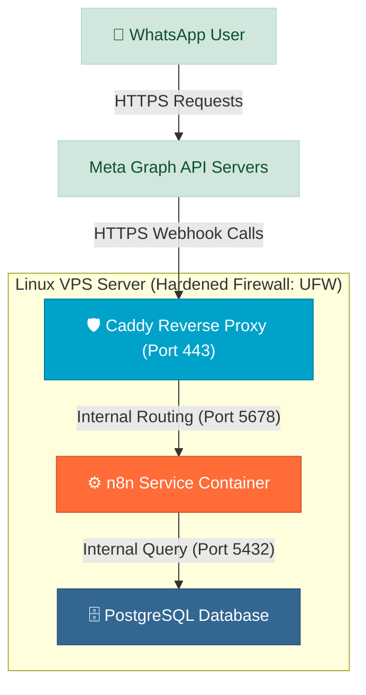

# Production VPS Server Deployment Guide

This guide provides instructions to deploy the Bilingual WhatsApp Real Estate Lead Generation System to a production-grade Virtual Private Server (VPS) running Linux (Ubuntu 22.04 LTS or 24.04 LTS), secured with SSL/TLS certificates, a reverse proxy, and strict firewalls.

---

## 🏗️ Production Architecture vs. Local Development

In development, we use `ngrok` to bypass routers and establish a direct connection to a local machine. For a production environment, this is insecure and unreliable. The production stack uses a dedicated cloud server (VPS) configured as follows:



### Key Production Diff
1. **Zero Public Port Exposure for DB**: Unlike local development where port `5432` is mapped to the host (`ports: - "5432:5432"`), the production Database container is accessible *only* within the Docker bridge network. No external attacker can attempt SQL brute-forcing.
2. **Reverse Proxy (Caddy)**: Caddy acts as our web gateway. It listens on public HTTP (`80`) and HTTPS (`443`) ports, intercepts webhook calls from Meta, terminates the SSL connection, and forwards traffic internally to n8n on port `5678`.
3. **Automated SSL/TLS (ACME)**: Caddy integrates natively with Let's Encrypt and ZeroSSL. Simply pointing a domain name to the VPS IP automatically triggers certificate provisioning and renewals without any Cron configuration.
4. **Persistent Uptime Daemon**: Docker containers are managed via `docker-compose` and bound to the host operating system's `systemd` daemon, guaranteeing auto-recovery on system crash or reboot.

---

## 🌐 Step 1: DNS and Domain Setup

Before building the server, you need a domain name (e.g., `agency.com`).

1. Log into your Domain Name Registrar (GoDaddy, Namecheap, Cloudflare, etc.).
2. Create an **A Record** pointing to your VPS public IPv4 address:
   * **Host**: `n8n` (or `@` for the root domain)
   * **Value**: `YOUR_VPS_PUBLIC_IP`
   * **TTL**: Auto or 3600 seconds
3. Verify that the DNS record has propagated (use `nslookup n8n.youragency.com` or [dnschecker.org](https://dnschecker.org)).

---

## 🛡️ Step 2: VPS Provisioning & Hardening

Once you boot your VPS (Ubuntu), access it via SSH and apply these basic security practices:

### 1. Update System Packages
```bash
sudo apt update && sudo apt upgrade -y
```

### 2. Configure Firewall (UFW)
Only expose SSH (`22`), HTTP (`80`), and HTTPS (`443`). Keep Postgres and n8n internal.
```bash
# Allow essential services
sudo ufw allow 22/tcp
sudo ufw allow 80/tcp
sudo ufw allow 443/tcp

# Enable firewall
sudo ufw enable
```

### 3. Install Docker & Docker Compose
```bash
# Install Docker
curl -fsSL https://get.docker.com -o get-docker.sh
sudo sh get-docker.sh

# Add your user to the docker group to avoid running with sudo
sudo usermod -aG docker $USER
newgrp docker
```

---

## 📦 Step 3: Production Directory Layout

On the VPS, create a structured directory for deployment:

```bash
mkdir -p ~/whatsapp-lead-bot
cd ~/whatsapp-lead-bot
mkdir -p caddy_data caddy_config postgres_data n8n_data
```

Create your production environment file `.env`:
```bash
nano .env
```
Add the production parameters:
```ini
# System Environment
NODE_ENV=production

# n8n General Config
N8N_ENCRYPTION_KEY=GenerateAStrongRandomStringHere32Chars!
WEBHOOK_URL=https://n8n.youragency.com/
PORT=5678

# Database Production Config
POSTGRES_USER=postgres_prod_admin
POSTGRES_PASSWORD=UseAHighlyComplexSecretPasswordHere2026!
POSTGRES_DB=whatsapp_lead_db

# APIs
OPENAI_API_KEY=sk-proj-xxxxxxxxxxxxxxxxxxxxxxxxxx
GOOGLE_SHEETS_ID=xxxxxxxxxxxxxxxxxxxxxxxxxxxxxxxxxxxx
META_ACCESS_TOKEN=EAABxxxxxxxxxxxxxxxxxxxxxxxxx
META_PHONE_NUMBER_ID=xxxxxxxxxxxxxxx
```

---

## 📄 Step 4: Caddyfile Configuration

Caddy requires a simple text file named `Caddyfile` to handle routing and SSL.

Create the file:
```bash
nano Caddyfile
```
Add the following layout:
```caddy
n8n.youragency.com {
    # Reverse proxy n8n container on internal port 5678
    reverse_proxy n8n:5678

    # Enable Gzip compression
    encode gzip

    # Set security headers
    header {
        # Protect against clickjacking
        X-Frame-Options "SAMEORIGIN"
        # Prevent MIME type sniffing
        X-Content-Type-Options "nosniff"
        # Enable XSS filtering in legacy browsers
        X-XSS-Protection "1; mode=block"
        # Strict Transport Security (HSTS)
        Strict-Transport-Security "max-age=31536000; includeSubDomains; preload"
        # Referrer Policy
        Referrer-Policy "strict-origin-when-cross-origin"
    }
}
```

---

## ⚙️ Step 5: Production Docker Compose Blueprint

Create `docker-compose.yml` optimized for VPS constraints:
```bash
nano docker-compose.yml
```

Add this deployment-ready configuration:
```yaml
version: '3.8'

networks:
  production-net:
    driver: bridge

services:
  # Caddy Reverse Proxy & SSL Manager
  caddy:
    image: caddy:2-alpine
    container_name: production_caddy
    restart: unless-stopped
    ports:
      - "80:80"
      - "443:443"
    volumes:
      - ./Caddyfile:/etc/caddy/Caddyfile
      - ./caddy_data:/data
      - ./caddy_config:/config
    networks:
      - production-net
    depends_on:
      - n8n

  # PostgreSQL Log & Memory Database
  postgres:
    image: postgres:16-alpine
    container_name: production_postgres
    restart: unless-stopped
    environment:
      POSTGRES_USER: ${POSTGRES_USER}
      POSTGRES_PASSWORD: ${POSTGRES_PASSWORD}
      POSTGRES_DB: ${POSTGRES_DB}
    # NOTE: Ports are NOT exposed to the host system
    volumes:
      - ./postgres_data:/var/lib/postgresql/data
      - ./init.sql:/docker-entrypoint-initdb.d/init.sql
    networks:
      - production-net
    healthcheck:
      test: ["CMD-SHELL", "pg_isready -U $$POSTGRES_USER -d $$POSTGRES_DB"]
      interval: 5s
      timeout: 5s
      retries: 5

  # n8n Automation Engine
  n8n:
    image: docker.n8n.io/n8nio/n8n:latest
    container_name: production_n8n
    restart: unless-stopped
    environment:
      - DB_TYPE=postgresdb
      - DB_POSTGRESDB_HOST=postgres
      - DB_POSTGRESDB_PORT=5432
      - DB_POSTGRESDB_DATABASE=${POSTGRES_DB}
      - DB_POSTGRESDB_USER=${POSTGRES_USER}
      - DB_POSTGRESDB_PASSWORD=${POSTGRES_PASSWORD}
      - N8N_ENCRYPTION_KEY=${N8N_ENCRYPTION_KEY}
      - WEBHOOK_URL=${WEBHOOK_URL}
      - NODE_ENV=production
    volumes:
      - ./n8n_data:/home/node/.n8n
    networks:
      - production-net
    depends_on:
      postgres:
        condition: service_healthy
```

### Launch the Stack
Copy your local `init.sql` schema script to the root directory `~/whatsapp-lead-bot/init.sql`, then launch:
```bash
docker compose up -d
```
Caddy will boot, fetch an SSL certificate for `n8n.youragency.com`, and n8n will initialize on database connection. 

Verify the containers are running:
```bash
docker compose ps
```

---

## 🔄 Step 6: System Persistence & Auto-Reboots

To ensure that the Docker service and your lead-generation bot start automatically if the VPS experiences a hard hardware reboot, configure systemd:

```bash
# Enable Docker system service
sudo systemctl enable docker.service
sudo systemctl enable containerd.service
```

Since we configured all services in `docker-compose.yml` with `restart: unless-stopped`, they will spin up automatically on system boot.

---

## 💾 Step 7: Production Database Backup Script

A professional agency case study must account for database resilience. Implement automated daily database dumps to protect customer data and conversation history logs.

### 1. Create a backup script
```bash
mkdir -p ~/backups
nano ~/backups/backup_db.sh
```

Add this script logic:
```bash
#!/bin/bash
BACKUP_DIR="/home/ubuntu/backups"
TIMESTAMP=$(date +"%Y%m%d_%H%M%S")
BACKUP_FILE="$BACKUP_DIR/whatsapp_lead_db_$TIMESTAMP.sql"

# Run PostgreSQL dump inside the running docker container
docker exec production_postgres pg_dump -U postgres_prod_admin -d whatsapp_lead_db > $BACKUP_FILE

# Compress backup
gzip $BACKUP_FILE

# Delete backups older than 7 days to preserve disk space
find $BACKUP_DIR -type f -name "*.sql.gz" -mtime +7 -delete
```

Make the script executable:
```bash
chmod +x ~/backups/backup_db.sh
```

### 2. Schedule Daily Backup with Cron
```bash
crontab -e
```
Add this cron configuration to execute backups every night at 2:00 AM:
```cron
0 2 * * * /home/ubuntu/backups/backup_db.sh >/dev/null 2>&1
```

---

## 🚦 Verification Checklist

Once deployed to production:
1. Open `https://n8n.youragency.com` in a browser. It should load the n8n dashboard with a secure SSL padlock icon.
2. Inside n8n ➔ **Settings** ➔ verify the Webhook URL is set to `https://n8n.youragency.com/`.
3. In Meta Developer Console ➔ Update Webhook Callback URL to:
   `https://n8n.youragency.com/rest/webhooks/whatsapp`
4. Send a WhatsApp message to confirm the E2E pipeline triggers and writes database logs and Google Sheet CRM records successfully.
